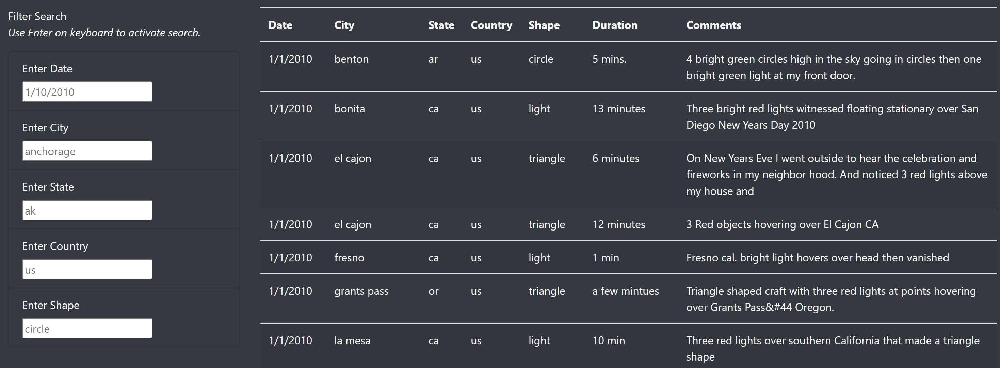
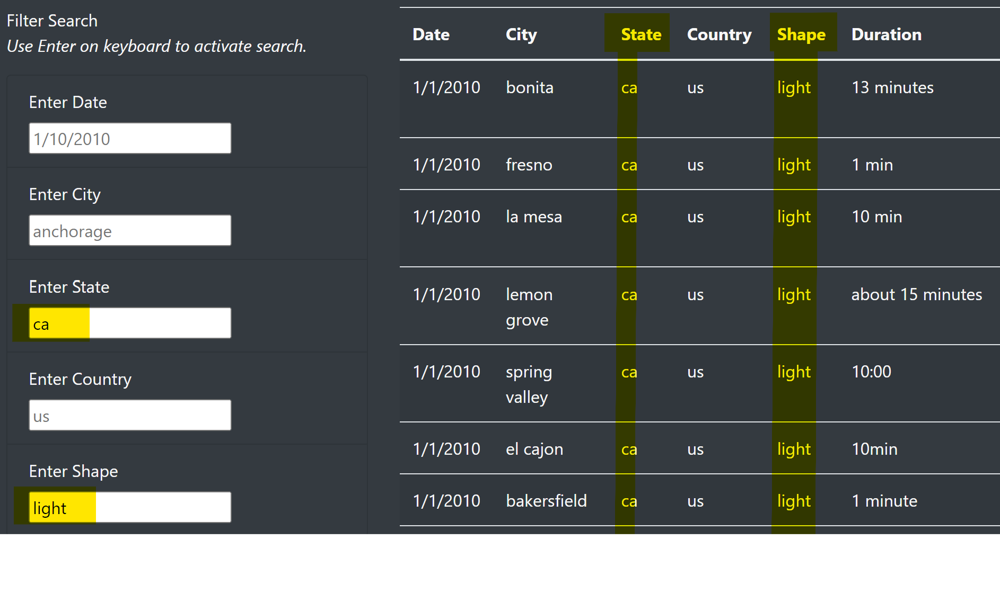

# UFOs

#### DABC Module 11 Challenge
#### August 27, 2022
#### Laurina LaStella
---

## Overview of Project:
Provide a more in-depth analysis of UFO sightings by allowing users to filter for multiple criteria at the same time. In addition to the date, add table filters for the city, state, country, and shape.

---

## Results: 

The website includes a section called "Filter Search" for filtering the list of sightings. Use the Enter key on your keyboard to activate each filter box. Each field entered will narrow the list of sightings. All of the filters must be true for the sighting to be listed.

With no filters, all sightings are listed:

With filters, the list of sightings is limited to only sightings where all filters apply to the sighting.

---
## Summary: 

- Drawback: Each search term must be an exact match to the data. No partial terms will match.

- Recommendation 1: Make the filter inputs into drop-down lists of the available options, so the user can see what options are available. If these were created from an automated function, they would update when new entries were added to the source data.

- Recommendation 2: Include the Comments in the filter function. But not as a drop-down list. This should be free text entry, and allow partial matches.

